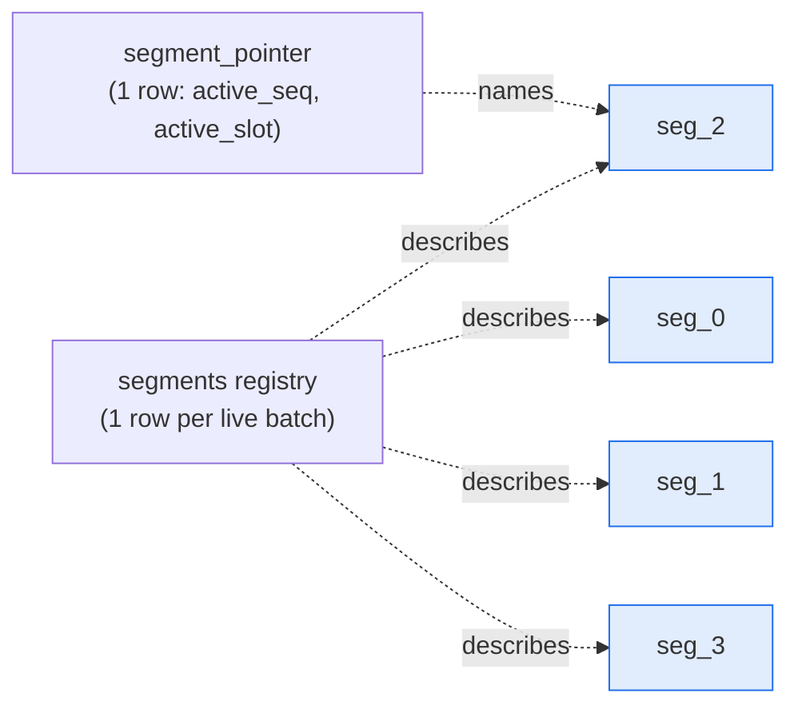

# Stage 2 — The staging area: an append-only ring of segments

← [Intake](01-intake-and-lsn-confirmation.md) · next → [Sealing and the fence](03-sealing-and-the-fence.md)

**What this stage owns:** the physical shape of the durable worklist — how a
change is written, and why nothing on the hot path is ever updated or deleted.

**The guarantee:** *producers never coordinate with each other or with
consumers.* An append takes no lock beyond its own row insert, and no producer
can block a consumer or a seal.

## What replaced what

The obvious design for a worklist is *one row per pending key*, merged on write:

```sql
INSERT INTO worklist (table, key, lsn, old_image, new_image) VALUES (...)
ON CONFLICT (table, key) DO UPDATE SET lsn = GREATEST(...), new_image = EXCLUDED.new_image, ...
```

then claimed with `SELECT … FOR UPDATE SKIP LOCKED LIMIT n` and deleted on
completion. It works but does not scale: the claim convoys under drainer count,
and every row is inserted, updated repeatedly, locked, and deleted — the worst
possible workload for MVCC bloat.

The replacement inverts it. **Producers append blind. Merging happens at read
time.** Nothing on the hot path ever issues an `UPDATE` or `DELETE` against a
staged row. That property makes throughput flat in worker count instead of
convoying, and moves the vacuum burden onto three small metadata tables where
autovacuum can keep up.

## The objects



**The ring tables** (`seg_0 … seg_{N-1}`, default N = 4, minimum 3) hold the
staged changes. They are created with:

```sql
WITH (fillfactor = 100, autovacuum_enabled = off)
```

defensible only *because* they are append + `TRUNCATE`, never `UPDATE`: no dead
tuples to vacuum, no free space to reserve. One consequence, documented in
[07](07-convergence-and-await.md): disabling autovacuum also disables
**autoANALYZE**, so these tables have no planner statistics unless you write
them yourself.

**The pointer** is a single row naming which ring slot is currently `active`. It
is pinned to exactly one row (`id bool PRIMARY KEY DEFAULT true CHECK (id)`).
Writers **read it inside their writing transaction and do not lock it** — see
below.

**The registry** holds one row per live batch: its state, its fence, its bucket
split, its timestamps. `seg_seq` is monotonic and **never reused**; the physical
`ring_slot` is. Every ordering argument in the design is in `seg_seq`, never
slot number — that is what makes slot reuse safe.

## The append

```sql
INSERT INTO seg_<active> (src_table, key, op, lsn, old_image, new_image,
                          origin_lsn, src_changed, hop_gen, group_key)
VALUES (...), (...), ...;
```

No `ON CONFLICT`. No merge. One row per raw change. Three columns are supplied
by the *table definition* rather than by the producer, which is the trick that
makes them free:

| Column | How it is populated | Why not client-side |
|---|---|---|
| `row_txid` | `DEFAULT txid_current()` | it must be the writer's real top-level xid at statement time — this is the fence ([03](03-sealing-and-the-fence.md)) |
| `appended_at` | `DEFAULT now()` | the latency origin. Stamping it on the registry row instead would make an in-flight writer hold the row a seal must flip, converting clean backpressure into a hard block |
| `route` | `GENERATED ALWAYS AS (hash(src_table ‖ 0x1f ‖ key) & 0x7fffffff) STORED` | the partition key ([04](04-claiming-and-the-fold.md)) |

All three ride the insert that is happening anyway: no extra statement, no extra
round trip, and — decisively — **no extra lock**.

`route` must reach **all four producers**, which do not share a code path: three
append client-rendered `VALUES` tuples, while backfill appends server-side via
`INSERT … SELECT`. A client-stamped route would be rendered twice, in two
languages; the first divergence lands one key in two partitions. A generated
column is the only shape with a single definition.

It is **stored, not recomputed at read time** — not an optimization. `hashtext`
is immutable within a build but not across major versions, so a batch drained
partly under one hash and finished under another would re-apply every row that
changed bucket. On a non-idempotent delta path, that is corruption.

## The four producers

All four append into the active segment through the same path, and the design is
much easier to keep correct because there is only one:

| Producer | What it appends | Carries images? |
|---|---|---|
| CDC intake | the decoded change | yes — `old_image` and/or `new_image` |
| Reverse propagation (a worker staging its dependents) | a bare recompute trigger | **no** |
| Definition re-derive (a formula changed) | a bare recompute trigger | **no** |
| Backfill / snapshot enumeration | a bare recompute trigger, server-side | **no** |

That split matters. An **image-less row** is not a change — it asserts nothing
about the row's state, it only says "recompute this key." The fold treats the
two kinds differently; the bug from conflating them is in
[04](04-claiming-and-the-fold.md).

Note the second row: **a worker doing reverse propagation appends into the
*active* segment — never the batch it is currently draining.** That is what
makes a claimed batch immutable, the foundation of
[05](05-apply-and-exactly-once-deltas.md).

## Why the pointer is read but not locked

The instinct is to lock the pointer so a writer cannot read it while a seal
flips it. Do not: that serializes every append against every seal, and the
pointer is the hottest row in the system.

Instead: **a stale read is expected, and the fence accounts for it.** The writer
resolves the pointer inside its writing transaction — tying its `row_txid` to
the value it read — then writes into whatever slot it resolved. If a seal
flipped in between, the row lands in what is now the *predecessor* slot after it
was sealed: a **straddler**, and picking it up exactly once is what
[03](03-sealing-and-the-fence.md) exists to do.

This is the central trade in the design: *pay for stale reads once, in a read-time
fence, instead of paying for coordination on every single append.*

## What is mutable, and why that is the whole point

| Table | Written how | Vacuum posture |
|---|---|---|
| ring tables | INSERT + TRUNCATE only | `autovacuum_enabled = off`, `fillfactor = 100` |
| pointer | UPDATE once per seal | aggressive autovacuum, `fillfactor = 90` |
| registry | UPDATE per state transition | aggressive autovacuum, `fillfactor = 70` |
| claims | INSERT per claim, DELETE per completion | aggressive autovacuum, `fillfactor = 70` |

The bloat surface moves off the high-volume tables onto three small ones, where
vacuum is effective. A design where the high-volume table is also the
hot-update table needs constant vacuum tuning forever.

## Ring size and backpressure

The ring is finite (default 4 slots). A seal that would lap a slot still holding
a live registry row **fails with `RingFull` and blocks** — it does not
overwrite, which would destroy un-applied work. Backpressure is the correct
response to consumers falling behind; silent loss is not.

The slot is freed by **removing the registry row**, not by truncating the table —
see [06](06-cleanup-and-reclaim.md).
