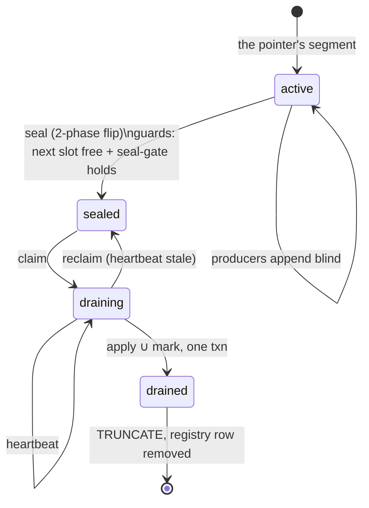

# Stage 3 — Sealing: turning an append stream into immutable batches

← [The staging ring](02-the-staging-ring.md) · next → [Claiming and the fold](04-claiming-and-the-fold.md)

**What this stage owns:** cutting the continuous append stream into batches that
are immutable, and proving that every appended row belongs to exactly one of
them.

**The guarantee:** *every staged row is claimed by exactly one batch — none in
two (a double apply), none in zero (silently lost work).* Both failure modes are
silent, so this is the part most likely to be got subtly wrong.

## The state machine



Four states, and one function is the single source of truth for which edges are
legal. Keep that function; a state machine whose transitions are spread across
call sites cannot be reviewed.

## Why a naïve cut does not work

The instinct is: flip the pointer to a new slot, and declare that the old slot is
now a complete batch. It is not:

> A writer may have read the pointer *before* the flip, and commit its insert
> into the old slot *after* the flip.

Call that row a **straddler**. It is physically in the sealed slot but was not
there when the seal happened. If the batch's definition is "the rows in this
table", the straddler is applied twice (once by this batch if it commits in
time, once by nothing) or zero times (if the batch already scanned past it and
the slot is then truncated). Both outcomes are silent.

You cannot fix this by locking the pointer — that is exactly the coordination
[02](02-the-staging-ring.md) refuses to pay for. So the batch boundary is defined
in **transaction-visibility space**, not in table space.

## The fence

Every ring row carries `row_txid`, force-assigned by `DEFAULT txid_current()` —
the writer's real top-level transaction id at statement time. The seal captures a
**transaction snapshot** `S_k` and stores it on the registry row. The batch is
then defined as:

> **Batch *k*** = the rows of `slot_k` that are **visible in `S_k`**, **plus** the
> rows of `slot_{k-1}` that are visible in `S_k` and **not** visible in `S_{k-1}`.

That is the **both-slots read**. The predecessor half is what picks up the
straddlers that batch *k−1* could not see.

Two properties fall out — the whole correctness argument:

- **Disjoint.** A row in `slot_j` is claimed by batch *j* iff it is visible in
  `S_j`, and by batch *j+1* iff it is visible in `S_{j+1}` and not in `S_j`.
  Those conditions cannot both hold. Exactly-once.
- **Complete.** Their union is "visible in `S_{j+1}`", and the seal gate (below)
  guarantees every writer that targeted `slot_j` is visible by the time `S_{j+1}`
  is captured.

Batch 0 has no predecessor: `S_{-1}` is the empty snapshot, so every row of the
first slot qualifies.

### The scoping bug worth knowing about

The `NOT visible in S_{k-1}` clause must apply **only to the predecessor half**.
Applying it uniformly across both slots is the natural-looking simplification and
it loses work: a writer that resolved the pointer in the window between the
flip's `COMMIT` and the capture of `S_k` writes into the *new* slot and can
commit before `S_k` is taken. It is therefore visible in `S_k` and belongs to
batch *k* — but a uniform `NOT visible in S_{k-1}` filter on the new slot… does
nothing, while batch *k+1*'s `NOT visible in S_k` correctly discards it. Neither
batch claims it. The slot truncates. The work is gone.

The reason is structural: `slot_k` was scanned by no earlier batch, so nothing
about it needs de-duplicating, while `slot_{k-1}` was scanned by batch *k−1* and
needs exactly that de-duplication. Different slots, different clauses.

## The two-phase seal

The seal is **two transactions** — the split fixes the deepest hole in the naïve
version.

**Phase 1** (one transaction):
1. check the guards (below);
2. stamp `seal_step1 = txid_current()`;
3. finalize the segment's summary band from a single aggregate over its now-frozen
   table;
4. fill the **predecessor's** `seal_step2` with this flip's xid;
5. allocate the next `seg_seq` into the next slot as `active`;
6. flip the pointer — last;
7. `COMMIT`.

**Phase 2** (a *separate* transaction, after the flip has committed and is
visible): capture and record `seal_snapshot = S_k`.

**`seal_snapshot` must never be taken inside the flip transaction.** Taken after
the flip commits, no writer holding an old-pointer read can have an xid at or
above `xmax(S_k)`, which is what makes the fence sound. Taken inside, it can, and
the fence silently admits or drops rows depending on timing.

### The `xmax` trap

`txid_snapshot_xmax` is **not** "the next unassigned transaction id". Postgres
sets `xmax = latestCompletedXid + 1`, and the in-progress list contains only
running transaction ids *below* that. A transaction whose xid was assigned but
which has not committed — with nothing above it having completed — therefore sits
at or above `xmax` and is **absent from the in-progress list**. The snapshot
cannot distinguish it from a transaction that does not exist yet.

That is exactly the straddling writer. It read the pointer as *k* and holds a
`slot_k` row, but if it is the highest xid around when `S_k` is captured then
`row_txid >= xmax(S_k)`: invisible in `S_k`, so batch *k* skips it — and the seal
gate `xmin(now) >= xmax(S_k)` is *already true* while it runs, so `S_{k+1}` is
captured without it and batch *k+1* skips it too. Batch *k+2* never scans
`slot_k`. No batch folds the row, the segment still marks drained, and the slot
is reclaimed.

The fix is one statement, run in autocommit immediately before taking the
snapshot:

```sql
SELECT txid_current();   -- assigns an xid AND commits it, raising latestCompletedXid
```

Now `xmax(S_k)` is strictly above every xid assigned before it — hence above
every writer that read the pointer as *k*. Still-running such writers land in the
in-progress list where they belong: batch *k* correctly skips them, the gate
correctly **blocks** `S_{k+1}` until they settle, and batch *k+1* claims them.
One extra round trip per seal, entirely off the append path.

It only works in autocommit. Inside an open transaction the `SELECT` does not
commit and `latestCompletedXid` does not move.

### `seal_snapshot` is write-once

The phase-2 write is scoped `AND state = 'sealed' AND seal_snapshot IS NULL`, so
the first writer wins and `S_k` is immutable once published. Without that guard,
phase 2 could stomp a snapshot that crash recovery had already reconstructed —
two unsynchronized writers to the published fence, which means silent
double-count or loss. A raced phase 2 matches zero rows — a **benign no-op** the
caller must treat as such.

> **Invariant:** `seal_snapshot` is written exactly once and never inside the flip
> transaction — a published fence, and a mutable one is corruption.

## The two guards — both are backpressure, never overwrite

A refused seal is always the correct outcome:

- **`RingFull`** — the next slot still carries a live registry row. Sealing would
  lap it and destroy un-applied work. The blocker is cleared by the cleanup pass
  removing that registry row ([06](06-cleanup-and-reclaim.md)), so a drainer that
  hits `RingFull` runs the cleanup pass and retries the seal once. Without that
  retry, a ring full of drained-but-not-yet-retired slots wedges the whole system.
- **The seal gate** — `xmin(now) < xmax(predecessor's S_k)` means a writer that
  was in flight at the previous seal has not yet committed or aborted. Advancing
  the epoch now could admit a straggler that spans **two** batch boundaries,
  outside the sealed ∪ predecessor footprint the both-slots read covers. A
  predecessor that exists but whose `seal_snapshot` is not yet captured *holds*
  the gate until it's published — you can't prove settlement against a snapshot
  you can't read. A predecessor that doesn't exist at all does not.

A third outcome, **`Raced`**, means another worker sealed this active segment
first. The pointer read is a plain `SELECT`, so two idle workers can both plan a
seal; the row lock on the registry serializes the two `state = 'active'` updates
and the loser's `WHERE` matches zero rows. It backs off rather than blindly
inserting an already-taken `seg_seq`.

## Who seals, and when

**There is no timer.** A worker that finds nothing claimable and sees rows in the
active segment seals it on demand, then retries the claim exactly once. The
busy-loop guard is structural: it seals only a *non-empty* active segment, at
most one seal per drain call.

Seal-on-demand is deliberate. A fixed roll cadence (seal every 200 ms, say) makes
every small change wait for the tick. Instead, **a batch is not a transaction** —
it is everything appended since the last on-demand seal, so a trickle workload
seals immediately and a bulk workload accumulates larger batches. Batch size
adapts to load without a knob.

## Crash recovery: the one window that wedges

| Crash point | Left behind | Recovery |
|---|---|---|
| producer mid-append | nothing (rolls back with its transaction) | — |
| **sealer between phase 1 and phase 2** | `state = 'sealed'`, `seal_step1` set, `seal_snapshot` NULL. The batch is unclaimable (a claim requires a snapshot) **and** its successor cannot seal (the gate blocks on the absent snapshot). **The ring wedges.** | a recovery pass reconstructs `S_k` at the flip boundary from `seal_step1`. It is **age-gated** (10 s) so it can never stomp a healthy in-flight seal's sub-millisecond phase gap, and the write is scoped to the still-incomplete state, so a concurrent recoverer or a normal completion matches zero rows |
| sealer after phase 2 | complete seal | — |

Without the age gate, recovery races every normal seal — back to two
unsynchronized writers to the published fence.

## A deliberately-skipped case

A `sealed` batch with no snapshot is **skipped by the claim, not claimed
carefully.** It has no fence, so folding it would silently drop rows. Failing
loud on "sealed but unfenced" — rather than treating a missing snapshot as
"admit everything" or "admit nothing" — is what turns that crash window into a
brief stall instead of a data-loss event.

## What is load-bearing here

- **The fence needs a per-row writer identity the store assigns**, not one the
  client supplies — `txid_current()` in a column default. The both-slots read
  depends on it.
- **The boundary requires snapshot isolation with an inspectable snapshot.** Under
  plain "read committed" the both-slots read has no meaning; Trellis relies on
  `txid_snapshot`.
- **The two-phase split is not optional.** Capturing the boundary snapshot inside
  the transaction that moves the boundary is unsound — that is the `xmax` trap
  above.
- **The crash window is designed for, not discovered.** Phase 1 landing without
  phase 2 wedges the ring on purpose, so the age-gated recovery pass is written
  alongside the seal, not bolted on later.
- **The boundary is tested directly.** Named tests for the straddler, the
  phase-gap writer, and the `xmax` case — those three writers are the entire risk
  surface, and none shows up unless a test deliberately holds a transaction open
  across a seal.
